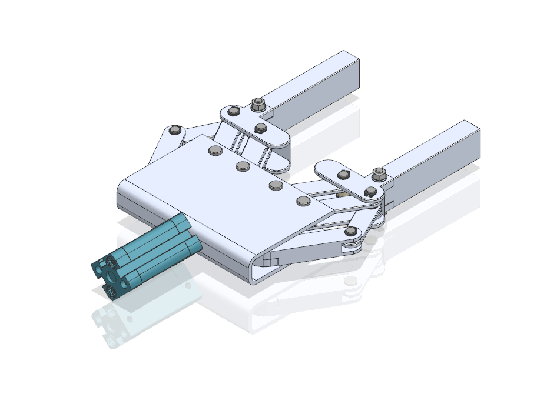

The aim of this project was to design a robotic gripper intended for handling electronic components, in particular larger microcontrollers. Due to its intended application, the gripper must meet specific requirements, such as:

ensuring a precise grip of a relatively small, lightweight and flat object without damaging its components,
the ability to pick up a low-profile component,
minimizing the risk of electrostatic discharge (ESD).

The design of the gripper required consideration of the specific nature of work in an electronics environment. As part of the project, various gripper concepts were analyzed, taking into account both mechanical and material aspects.

------

*Raport_PKR.pdf* - Project report

*chwytak.zip* - Final assembly (Siemens NX file)

