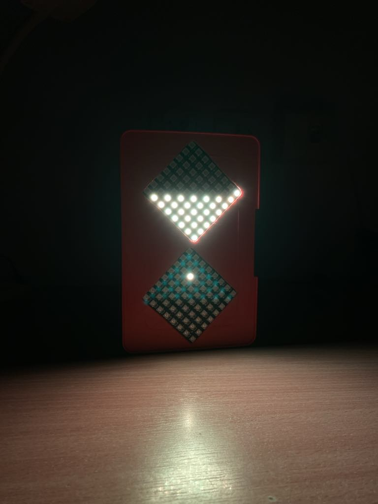

**LED Matrix Digital Hourglass Using ESP8266**

The project involved the development of a modern digital hourglass using LED matrices as an unconventional alternative to a traditional sand hourglass. The system was based on an ESP8266 microcontroller, LED matrices, an accelerometer and an external power supply.

As part of the project, a custom housing for the LED matrices was manually built and the electronic components were assembled inside it. The microcontroller was programmed to read the orientation of the device from the accelerometer and control the LEDs accordingly, creating a visual simulation of sand flowing through an hourglass.

The finished device can be used as a non-standard timer. Its software can also be modified to adjust the animation, timing or visual effects according to the user’s needs. The project was a practical opportunity to develop skills in microcontroller programming, electronics assembly and mechanical prototyping.

