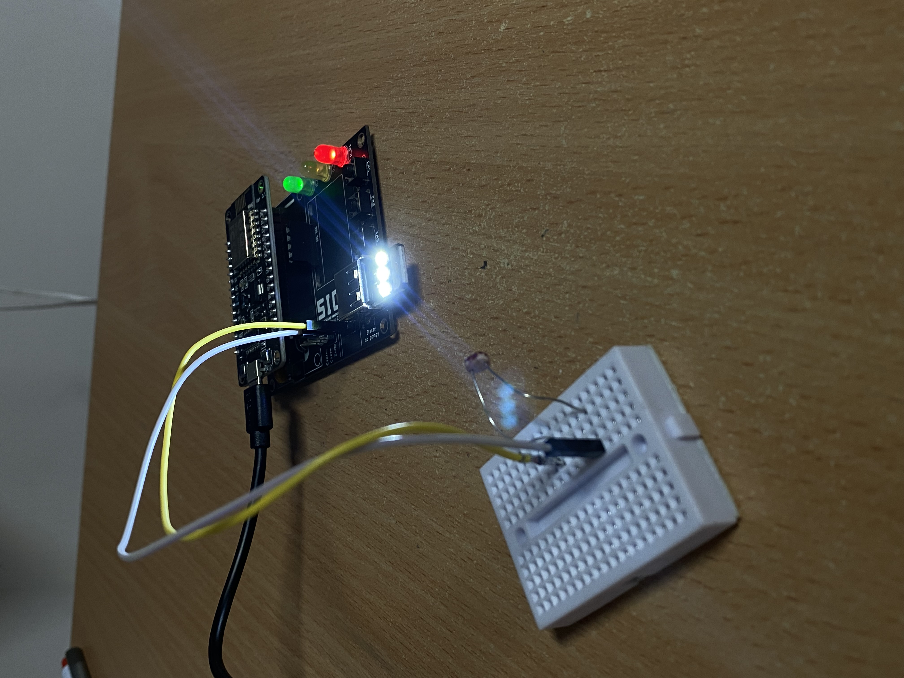

**PID-Based Adaptive Lighting Control Using ESP8266**

The project involved the development of an intelligent lighting system based on the ESP8266 microcontroller. The system automatically adjusts the brightness of an LED lamp depending on the amount of ambient light measured by a photoresistor.

A PID controller was used to ensure smooth and stable brightness regulation. When the level of external light decreases, the lamp increases its brightness, and when the ambient light increases, the lamp becomes dimmer. The LED brightness is controlled using PWM, which allows precise adjustment of the output light intensity.

The main goal of the project was to improve energy efficiency and user comfort by maintaining an appropriate lighting level under changing environmental conditions. The system can be used in smart homes, intelligent buildings, exhibition lighting systems, or small automated lighting applications.

The main limitations of the solution include sensitivity to measurement noise from the photoresistor and the need for careful tuning of the PID parameters. Incorrect values of the proportional, integral and derivative gains may lead to oscillations or unstable lamp brightness.

