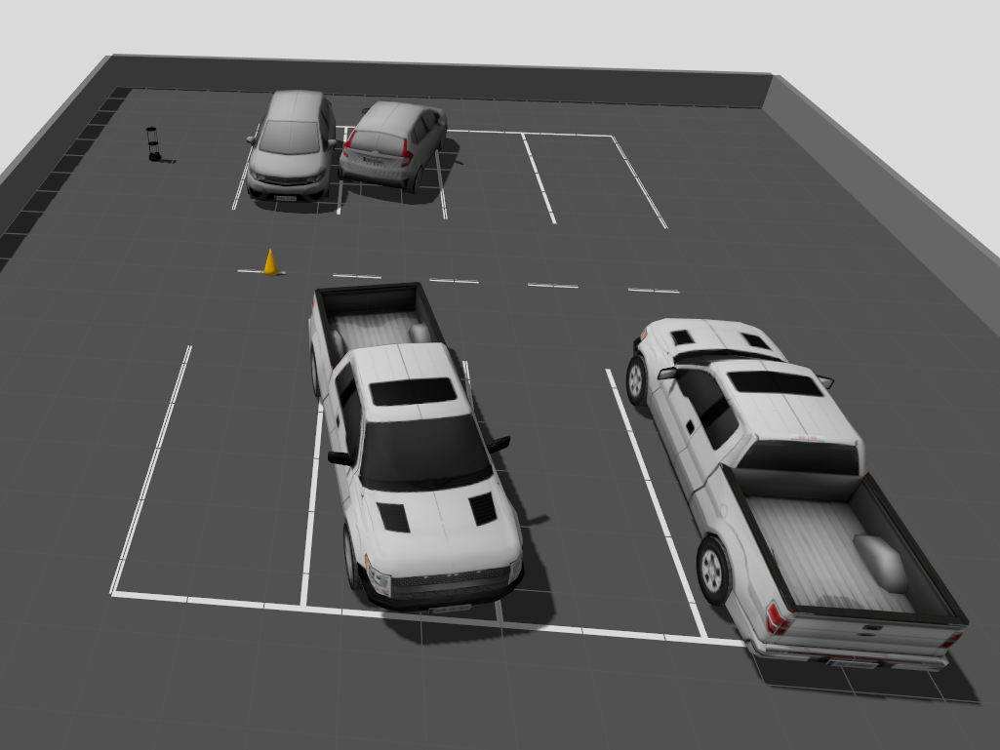

**Diploma Thesis:** *Mobile robot simulation for recognizing vehicle license plates*

**Keywords**: mobile robot, autonomous navigation, SLAM, Nav2, ANPR, YOLOv11, OpenCV, EasyOCR,
computer vision, simulation, Gazebo Harmonic, ROS 2, TurtleBot4

**Abstract**:
This thesis describes the development of a simulation of an autonomous mobile robot capable
of patrolling a parking lot, detecting vehicles parked in violation of parking space boundaries,
and reading their license plates. The work includes a literature review covering mobile robotics, autonomous
navigation, and computer vision, as well as experimental evaluation of the implemented
system.
The project was built around the TurtleBot4 platform, modified to meet the requirements of
parking inspection. Incorrect parking detection was based on the analysis of parking line continuity in
an RGB camera image using colour segmentation in the HSV colour space. License plate reading was
performed by an ANPR module combining the YOLO architecture for plate region localisation with
the EasyOCR library for text recognition. All components are coordinated by a master control node
that integrates autonomous navigation (Nav2) with detection modules within a single inspection
mission.
The system was validated through tests of individual modules and integrated end-to-end
tests in a simulation environment comprising Gazebo Harmonic as the simulator, ROS 2 Jazzy as the
communication and control layer, and RViz as the visualisation tool, all running on Ubuntu 24.04.
The conclusions summarise the conducted experiments, discuss the limitations of the adopted
approach, and propose directions for further development of the platform.

