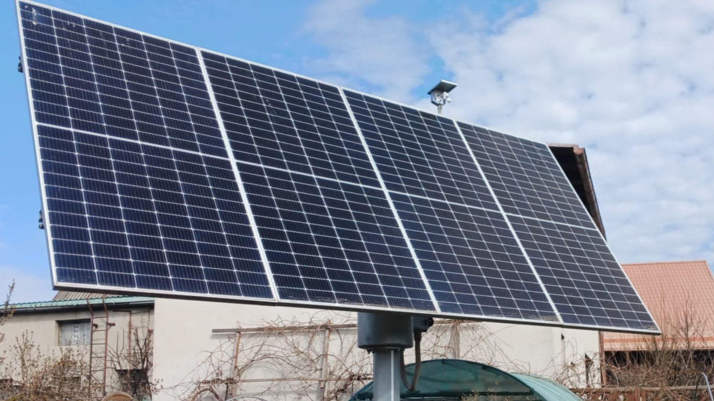
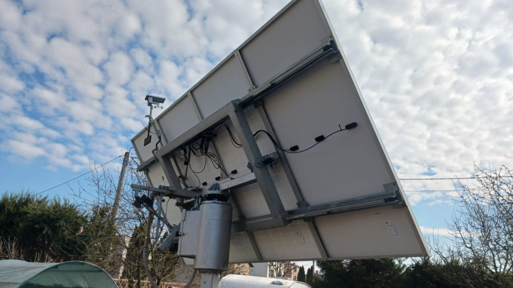

Co-created a dual-axis photovoltaic installation as part of a family engineering project with my father and grandfather. The system, based on a PLC control system, automatically adjusts panel position according to time-based solar tracking, increasing energy yield by approximately 35% compared to a fixed installation. It also includes an emergency folding mechanism for strong wind conditions to protect the structure.

